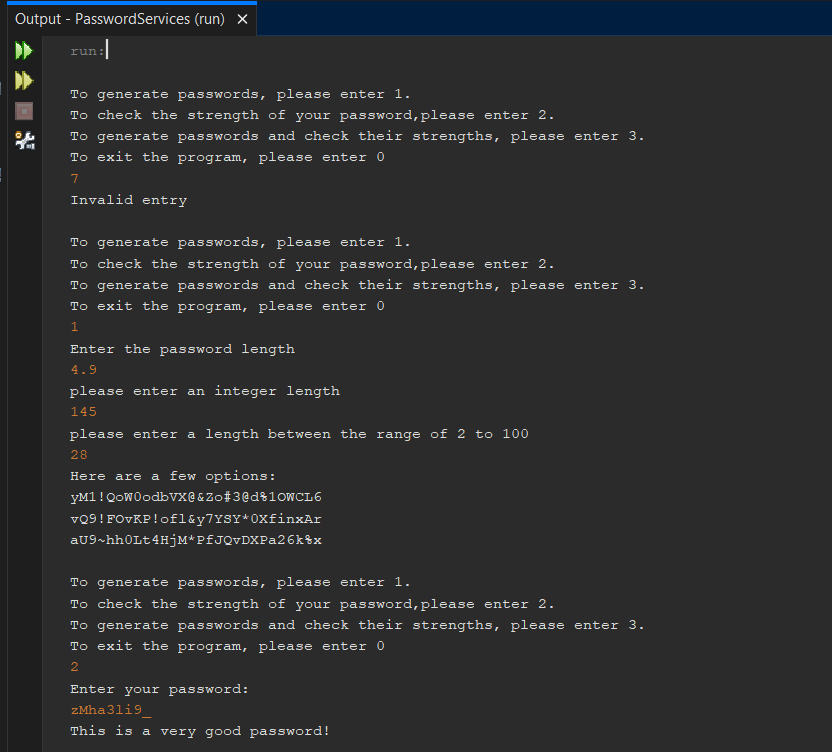
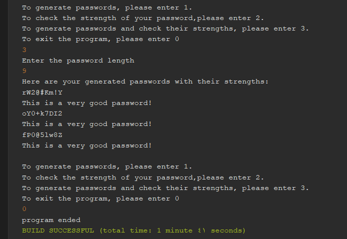

# generate-check-passwords-program
a simple program with java that generate passwords of any length the user wants, and checks the passwords strength that entered by the user.

## Here is a preview for all possiable outputs:
*(included the validation)*

